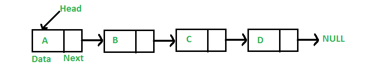

# Linked-Lists

A linked list is a linear data structure in which the elements are not stored at contiguous memory locations.
The elements are linked together by nodes that house the data and next node in the list. In a doubly linked list,
each node also has a reference to the previous node. 

The beginning of a linked list is referred to as the HEAD, and the end is referred to as the tail. Both of these
contain the NULL value.

 
Reference image from: https://www.geeksforgeeks.org/data-structures/linked-list/
